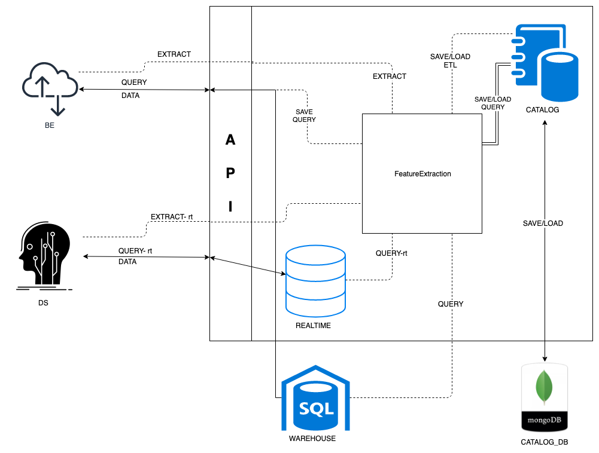

# Feature Store

## Running the code:

I recommend cloning the repo ```git clone https://github.com/miararoy/feature_store.git``` and running the ```example.ipynb``` jupyter notebook. This will run the full flow implemented:

1. Loading n_flow flows to database
2. DS querying and saving the query
3. DS performing feature extraction
4. DS extracting features and saves etl
5. BE runs the DS's query from the feature store
6. BE runs the DS's feature extraction from the feature store

# Key Concepts

1. DS handles queries and feature extraction (etl) - he knows what data to pull and how to handle it
2. BE should not implement queries and feature extraction (etl) - this should be communicated via query_id and etl_id
3. sql consistency: by using the same sql query in training and in serving (sql wrapping with where clause)
4. etls should be deployed via git (atm link, in real life - via github integration) for version control
5. schema comparison: when etl is saved to catalog it's data schema is saved and compared with new realtime data

## main features

1. Data extration (queries):
   1. query warehouse for training DS models
   2. query in app (real time) data for real time predictions (serving)
   3. save and load queries to catalog for re-querying
2. Feature extractions:
   1. load feature extraction (etl) transformations from git
   2. run feature exraction against query
   3. save and load feature extraction (etl) to catalog
   4. compare training and realtime data for 100% consistency 

## What would I improve?

0. TESTS!
1. integration to github
2. using pickling of etl (tried, impl. took too much time so I dropped it)
3. train models on feature store
4. Authentication and security
5. Idempotency: hash the query with HMAC to make sure identical queries are not saved to database
6. query cache - if query is performed a lot, cache it as view in a faster database
7. Concurrency - some calls should be atomic but others should run in seperate threads.


# Architecture

Feature store encapsules data query and feature extraction and exposes APIs for both data scientists and backend engineers.



## Components:

- Catalog: save and/or load queries and etls to catalog database (mongoDB)
- Realtime: in memory sql db to run 'hot' queries
- FeatureExtraction:
    1. load etl from git .py file
    2. run queries and pull data from realtime / warehouse database.
    3. run feature extraction on pulled data
    4. save feature extraction (etl) to catalog
    

# API DOCUMENTATION
## extract/realtime
## POST
### app.extract_realtime
runs a query against training database
### Expected Response Types
| Response | Reason |
| -------- | ------ |
| 200      | OK     |
| 500      | Failed |

### Parameters
| Name  | In   | Description      | Required? | Type                                 |
| ----- | ---- | ---------------- | --------- | ------------------------------------ |
| query | body | the query to run | true      | [extract_rt](#extract_rt-definition) |

| Produces          |
| ----------------- |
| application/json; |

| Consumes         |
| ---------------- |
| application/json |


## extract/train
## POST
### app.extract_train
runs a query against training database
### Expected Response Types
| Response | Reason |
| -------- | ------ |
| 200      | OK     |
| 500      | Failed |

### Parameters
| Name  | In    | Description                      | Required? | Type                           |
| ----- | ----- | -------------------------------- | --------- | ------------------------------ |
| query | body  | the query to run                 | true      | [extract](#extract-definition) |

| Produces          |
| ----------------- |
| application/json; |

| Consumes         |
| ---------------- |
| application/json |


## publish
## PUT
### app.publish
creates flows and save to db, emulate user flow

### Expected Response Types
| Response | Reason |
| -------- | ------ |
| 200      | OK     |
| 500      | Failed |

### Parameters
| Name    | In    | Description     | Required? | Type    |
| ------- | ----- | --------------- | --------- | ------- |
| n_flows | query | number of flows | true      | integer |

| Produces          |
| ----------------- |
| application/json; |


## query/realtime
## POST
### app.query_realtime
runs a query against training database
updates database with hf
### Expected Response Types
| Response | Reason |
| -------- | ------ |
| 200      | OK     |
| 500      | Failed |

### Parameters
| Name  | In   | Description      | Required? | Type                             |
| ----- | ---- | ---------------- | --------- | -------------------------------- |
| query | body | the query to run | true      | [query_rt](#query_rt-definition) |

| Produces         |
| ---------------- |
| application/json |

| Consumes         |
| ---------------- |
| application/json |


## query/train
## POST
### app.query_train
runs a query against training database
updates database with hf
### Expected Response Types
| Response | Reason |
| -------- | ------ |
| 200      | OK     |
| 500      | Failed |

### Parameters
| Name  | In    | Description                      | Required? | Type                       |
| ----- | ----- | -------------------------------- | --------- | -------------------------- |
| query | body  | the query to run                 | true      | [query](#query-definition) |

### Content Types Produced
| Produces          |
| ----------------- |
| application/json; |

### Content Types Consumed
| Consumes         |
| ---------------- |
| application/json |


## Definitions
### extract Definition
| Property | Type   | Format |
| -------- | ------ | ------ |
| query_id | string |        |
| etl_path | string |        |
### extract_rt Definition
| Property    | Type   | Format |
| ----------- | ------ | ------ |
| query_id    | string |        |
| etl_path    | string |        |
| index_key   | string |        |
| index_value | string |        |
### query Definition
| Property   | Type   | Format |
| ---------- | ------ | ------ |
| query      | string |        |
| query_name | string |        |
### query_rt Definition
| Property    | Type   | Format |
| ----------- | ------ | ------ |
|             |        |        |
| query_id    | string |        |
| index_key   | string |        |
| index_value | string |        |